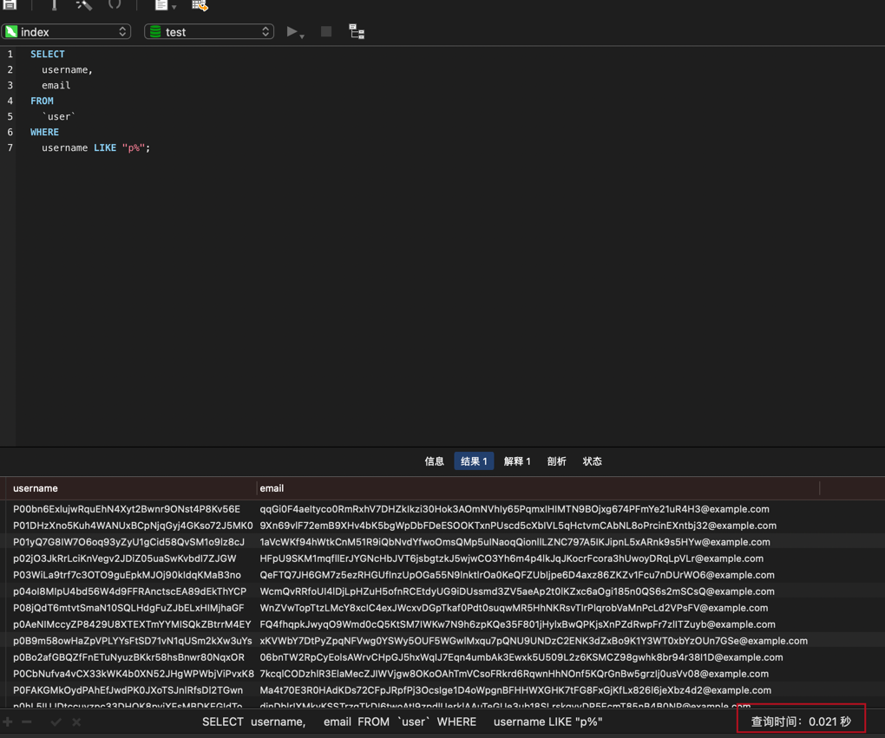
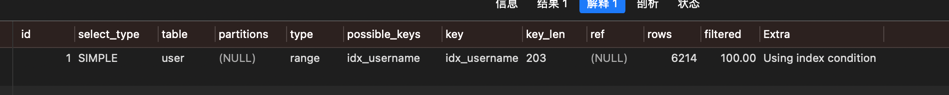
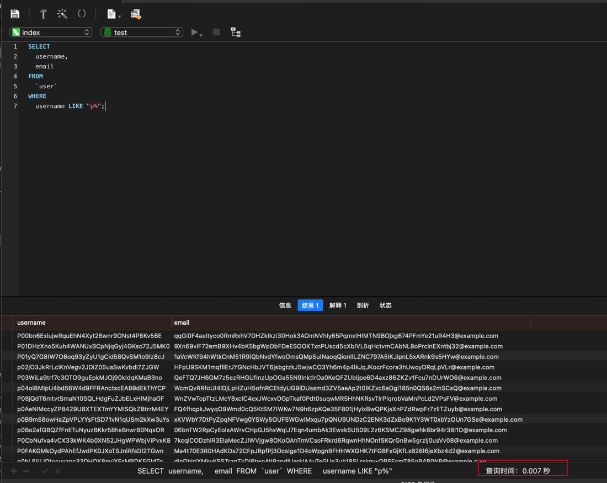
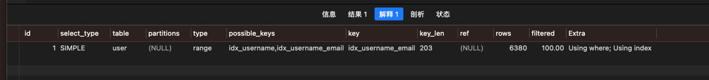
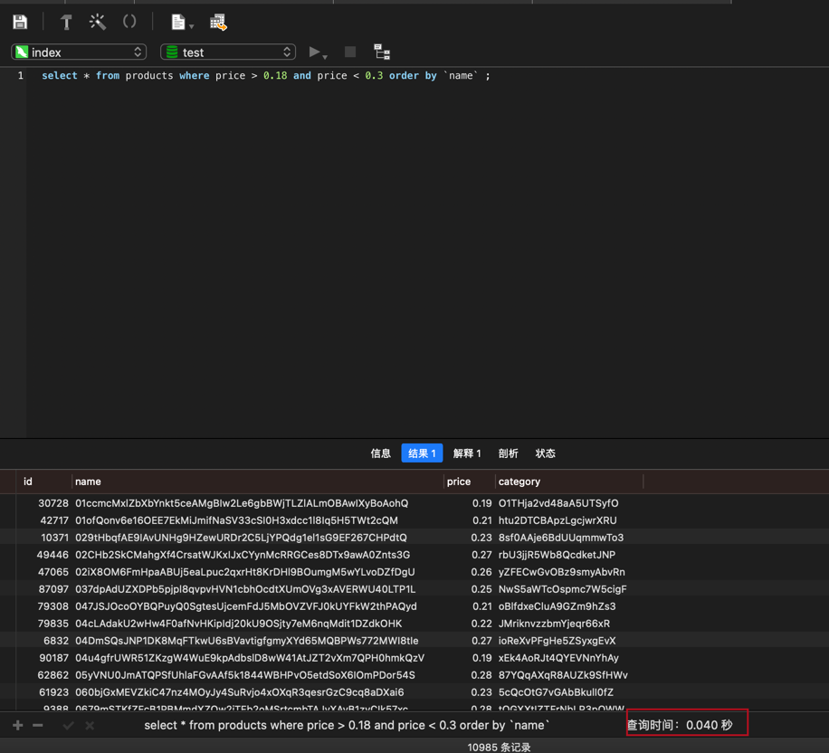
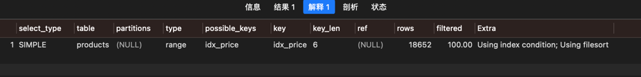
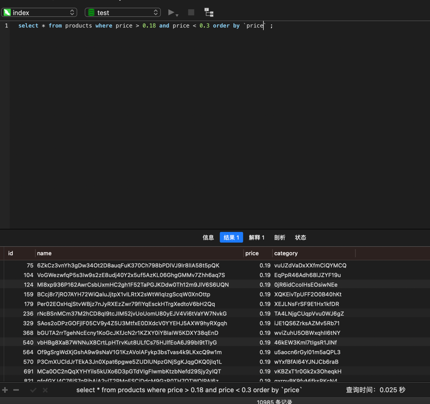
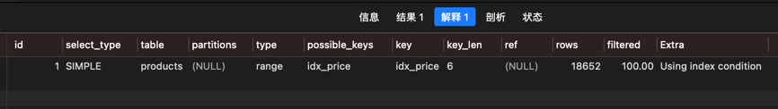
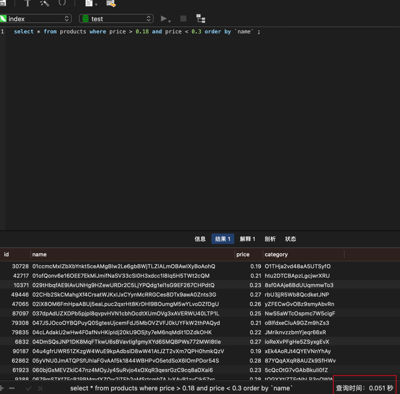
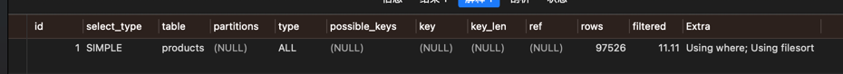

## 覆盖索引

- 准备数据
```api
运行 index/cover_index_test.go 下的 TestCoverIndex函数
```
- 只为username一个字段添加索引需要0.021s 
```api
查询语句
select `username`,`email` from `user` where username like "p%";
```



- 为username和email添加一个联合索引，查询仅需0.007s
```api
ALTER TABLE `test`.`user`
ADD INDEX `idx_username_email` (`username`, `email`);
查询语句和上面一样
```



##  索引和排序案例
数据准备
```api
运行 index/order_index_test.go下的TestOrderIndex函数
```

WHERE 命中 price字段的索引，但是 排序 是 name字段的索引
```api
查询语句
select * from products where price > 0.18 and price < 0.3 order by `name` ;
```


WHERE 命中 price 索引，排序也是 price 索引
```api
查询语句
select * from products where price > 0.18 and price < 0.3 order by `price` ;
```



WHERE 未命中索引 
```api
删除price的索引
ALTER TABLE `products` DROP INDEX `idx_price`;
查询语句
select * from products where price > 0.18 and price < 0.3 order by `name` ;
```

